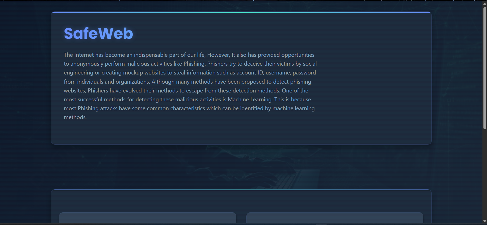
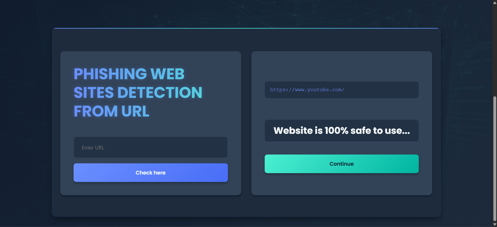

# 🌍 SafeWeb

SafeWeb is a web application that detects phishing websites and informs users about how safe a URL is.  
It uses a machine learning model trained on a variety of URL features to classify whether a site is **safe** or **phishing**.

---

## 🚀 Features
- Predicts whether a given URL is safe or phishing.
- Displays the probability (confidence) of safety.
- Gradient Boosting Classifier used as the final model after comparing various models.
- Real-time URL feature extraction using BeautifulSoup, `whois`, and other Python libraries.
- Modernized, responsive frontend built with Flask and HTML/CSS.
- Easy to deploy using Gunicorn for production environments.

---

## 🛠️ Tech Stack
- **Backend Framework:** Flask
- **Frontend:** HTML, CSS (Modern UI)
- **Machine Learning Model:** Gradient Boosting Classifier (GBC)
- **Feature Extraction:** Custom Python script scraping 30+ features per URL
- **Libraries Used:**  
  `scikit-learn`, `beautifulsoup4`, `requests`, `whois`, `googlesearch_python`, `numpy`, `pandas`, etc.

---

## 📈 Machine Learning Approach
- Multiple machine learning models were tested including Logistic Regression, Random Forest, SVM, and Gradient Boosting Classifier.
- Gradient Boosting Classifier was selected based on the highest testing accuracy and balanced performance.
- Model training and evaluation were done inside a Jupyter Notebook (see `Phishing URL Detection.ipynb`).

---

## 🧠 Feature Engineering
The model uses **30 features** extracted from the input URL. Examples include:
- IP Address usage
- Length of the URL
- Presence of special characters like `@` or `-`
- HTTPS usage
- Domain registration length
- Number of subdomains
- Favicon analysis
- Presence of abnormal URLs, redirects, pop-ups, iframe usage
- Website traffic and page rank
- Whether the URL appears in Google search results

All features are extracted automatically by `feature.py` using libraries like `BeautifulSoup`, `whois`, and `requests`.

---

## 📸 Screenshots
### Landing Page

### URL Input Page

---

## 🧩 Future Improvements
- Model retraining with an updated dataset for even better accuracy.
- Adding user authentication and history tracking.
- Showing more detailed reports about why a website was marked phishing.

## 🤝 Contributing
Contributions are welcome! Please open issues and pull requests for improvements or feature requests.
